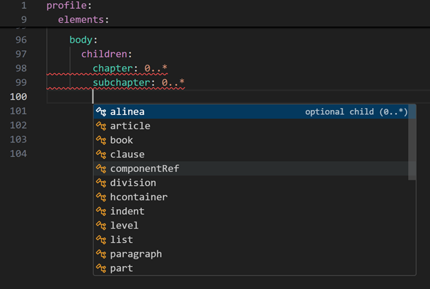
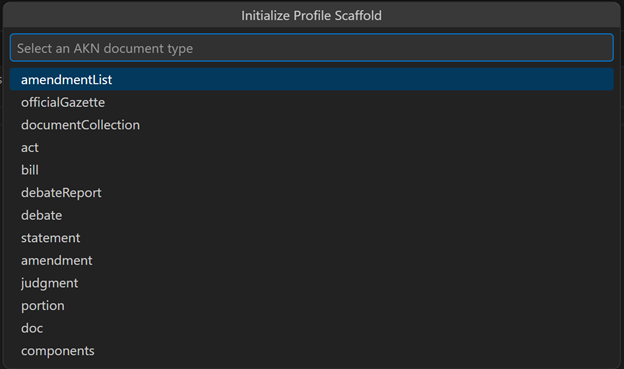
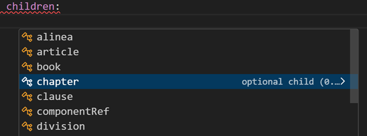
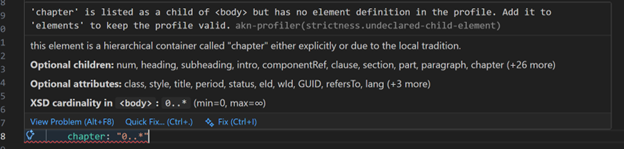
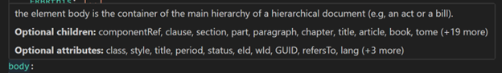
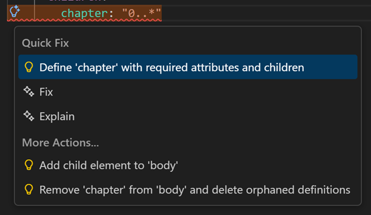

# AKN Profiler

Author [YAML application profiles](http://docs.oasis-open.org/legaldocml/akn-core/v1.0/akn-core-v1.0-part1-vocabulary.html) that restrict the Akoma Ntoso 3.0 XSD — defining which elements, attributes, children, and cardinalities a jurisdiction or use-case allows.

## Features

### New Profile Wizard

Run `AKN: New Profile` from the command palette, pick a document type, and get a complete skeleton with every required element, attribute, and cardinality pre-filled — ready to edit.

### Autocomplete

Suggestions are context-aware at every level of the profile: element names, attributes, children, document types, enum values, cardinality, structure entries, and choice branches. Only valid options for the current XSD position are offered.

### Inline Diagnostics

Six validation rule modules run as you type — vocabulary, structure, data types, identity, strictness, and choice groups. Errors and warnings appear inline with clear messages explaining what's wrong and how to fix it.

### Hover Documentation

Hover over any element, attribute, profile key, or cardinality value to see documentation pulled from the XSD. Choice groups show an "Either/or" summary of the available branches.

### Quick Fixes & Lightbulbs

Diagnostics come with one-click fixes — typo correction, scaffold insertion, cascade add for missing required elements. Lightbulb actions let you add or remove children, attributes, values, structure entries, and choice branches from any scope.

### And More

- **Cascade expand / collapse** — add an element with its full required-child chain, or remove one and clean up orphans, with diff preview
- **Choice groups** — `choice:` blocks for mutually exclusive child branches, validated and cross-checked against `children:`
- **Semantic highlighting** — distinct token colors for element names, attributes, keywords, enum values, cardinality, and booleans
- **Code lens** — one-click "Initialize Profile Scaffold" on empty `.akn.yaml` files

## Requirements

- **Python** ≥ 3.10 (on `PATH`, or set `aknProfiler.server.pythonPath`)
- **VS Code** ≥ 1.85

The extension automatically creates a `.venv` and installs the language server on first activation — no manual `pip install` needed.

## Extension Settings

| Setting | Default | Description |
|---|---|---|
| `aknProfiler.server.pythonPath` | `"python"` | Python interpreter used to run the language server |
| `aknProfiler.schema.version` | `"3.0"` | Akoma Ntoso schema version (currently only 3.0) |

## Known Issues

No known issues. If you encounter a problem, please [open an issue](https://github.com/TwinConsult-AS/akn-profiler/issues).

## Release Notes

### 0.1.1

Added XSD choice group support — `choice:` blocks, cross-block exclusion, choice validation rules, hover documentation, and auto-suggest chaining.

### 0.1.0

Initial release — autocomplete, diagnostics, hover, code actions, cascade expand/collapse, semantic highlighting, code lens, and New Profile wizard.

See the full [CHANGELOG](CHANGELOG.md) for details.

---

## Contributing

For development setup, project structure, and contribution guidelines, see [CONTRIBUTING.md](CONTRIBUTING.md).
